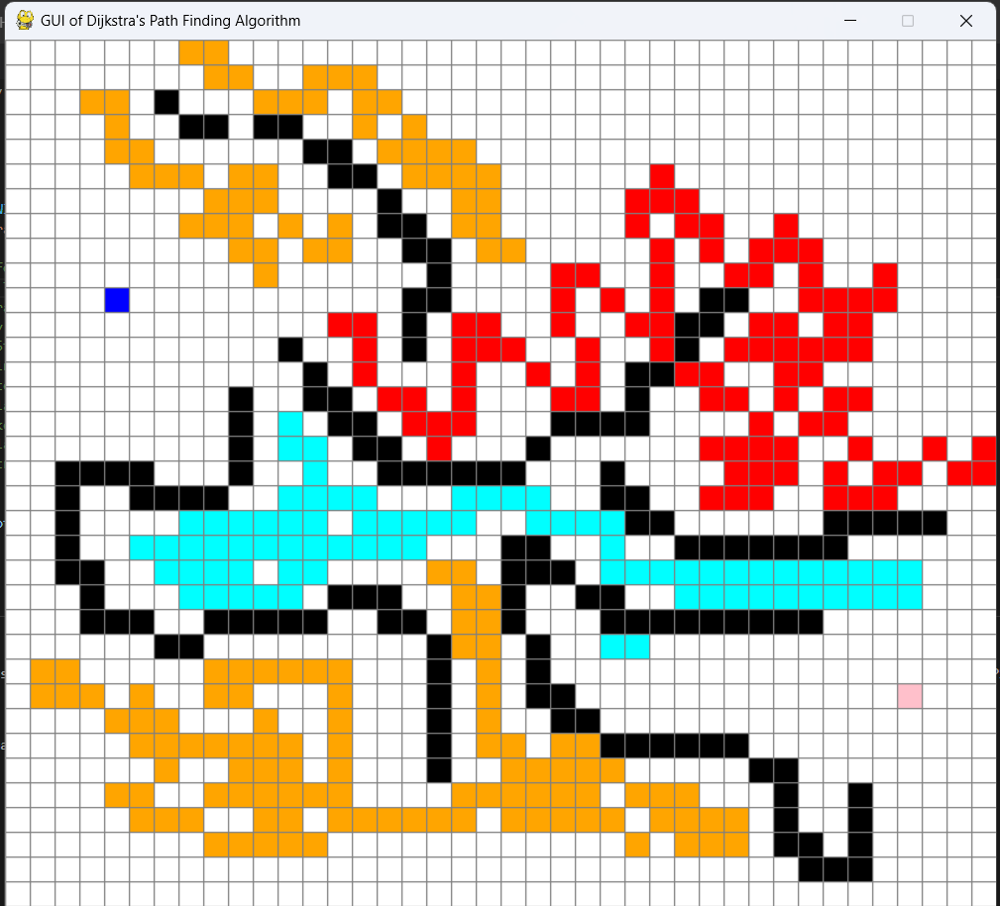
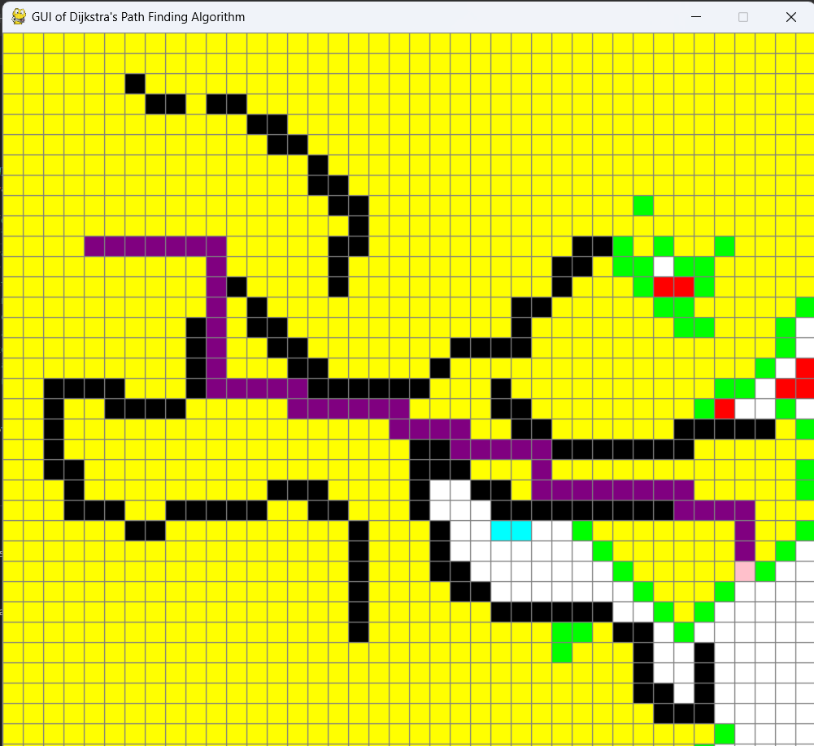

# PathFinder_GUI

I, along with my friend, have made a pathfinding visualizer that uses Dijkstra's algorithm to find the optimal path from the source to the destination on a grid map.

We have also implemented functions that allow the user to add paths with different levels of traffic (less, moderate, and high traffic) and also add barriers, simulating a real-life transport scenario.

## Features
- **Interactive Grid**: Set start and end points by clicking on the grid.
- **Weighted Roads**: Assign different weights to roads to simulate varying traffic conditions.
- **Barriers**: Create impassable barriers to test the algorithm's ability to find alternate routes.
- **Visualization**: Real-time visualization of the algorithm's progress and final path.

## Technologies Used
- Python
- Pygame for visualisation

## How to use it:
- Choose the start(blue) and destination(pink) square first by left-clicking the mouse at the start and end points.
- To add traffic:
  - Less Traffic(cyan): Press *1* and drag with the cursor by left-clicking on the grid.
  - Moderate Traffic(orange): Press *2* and drag with the cursor by left-clicking on the grid.
  - High Traffic(red): Press *3* and drag with the cursor by left-clicking on the grid.
- To make barriers(black): Drag with the cursor by right-clicking on the grid.
- To reset the grid: Press *r*.
- To start the demonstration: Press *spacebar*.

## Demonstration

Here's a cool demonstration that explains the project:

  
  

The video has also been attached. Kindly download and view it for futher clarification.

[Watch the video](simulation.mp4)

